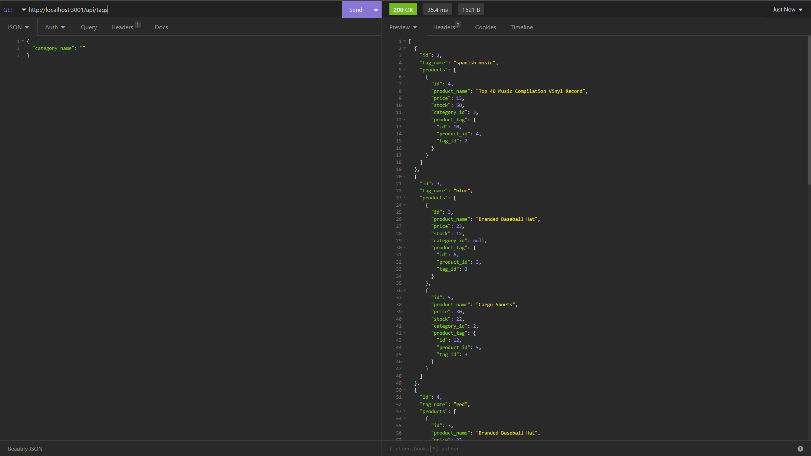

#  CxLos13-eCommerce-BackEnd

## Description
```
This application is a quick model of an ecommerce/ online retail site's back end of a website. The motivation behind this project was to become more familiar with working on the backend of applications. The purpose of this project was to create a strong backend application for an online retailer using sequelize to work with SQL databases and give the retailer a competetive edge in the software engineering field. The problem that this project solves is the clutter and disorganization some companies may struggle with if they do not have a team that is proficient in working on the backend of applications. In building this project, I learned how to seed a database using a javascript seeding file to create multiple tables with keys that link them to other tables with the assistance of sequelize, and how to bring it all together into one fully developed, functional, backend application. 
```

## Table of Contents 
	
- [Installation](#installation)
- [Usage](#usage)
- [Credits](#credits)
- [License](#license)
- [Badges](#badges)
- [Features](#features)
- [Tests](#tests)


## Installation

Please watch video.

## Usage

[CxLos13-eCommerce-BackEnd](https://github.com/CxLos/CxLos13-eCommerce-BackEnd)

[Walkthrough Video](https://drive.google.com/file/d/16Dgb2sXWiojJ8l-x0zxhJJlp4vhkFj1B/view)

[Video of Product routes working Properly](https://drive.google.com/file/d/1icsvxpvzvr8QCgn05yEkmBUuRGlKvMV2/view)



## Badges

N/A

## Features

N/A

## How to Contribute

N/A

## Tests

N/A

## Credits

N/A

## License
```
MIT License

Copyright (c) 2022 CxLos

Permission is hereby granted, free of charge, to any person obtaining a copy
of this software and associated documentation files (the "Software"), to deal
in the Software without restriction, including without limitation the rights
to use, copy, modify, merge, publish, distribute, sublicense, and/or sell
copies of the Software, and to permit persons to whom the Software is
furnished to do so, subject to the following conditions:

The above copyright notice and this permission notice shall be included in all
copies or substantial portions of the Software.

THE SOFTWARE IS PROVIDED "AS IS", WITHOUT WARRANTY OF ANY KIND, EXPRESS OR
IMPLIED, INCLUDING BUT NOT LIMITED TO THE WARRANTIES OF MERCHANTABILITY,
FITNESS FOR A PARTICULAR PURPOSE AND NONINFRINGEMENT. IN NO EVENT SHALL THE
AUTHORS OR COPYRIGHT HOLDERS BE LIABLE FOR ANY CLAIM, DAMAGES OR OTHER
LIABILITY, WHETHER IN AN ACTION OF CONTRACT, TORT OR OTHERWISE, ARISING FROM,
OUT OF OR IN CONNECTION WITH THE SOFTWARE OR THE USE OR OTHER DEALINGS IN THE
SOFTWARE.
```